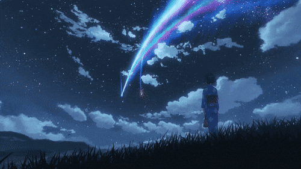

# You found me!

 
 

Hello! My name is Diogo Samuel Fernandes, and I'm currently a software engineer at Feedzai. I obtained a Master of Science degree from FEUP and thrive on tackling new challenges and solving complex problems. My favorite interests lie in the fields of distributed systems and machine learning. These areas fascinate me because they offer the opportunity to apply cutting-edge technology to solve complex problems, optimize processes, and create robust, scalable solutions. In my leisure time, I like to read books, listen to music, and gazing the stars at night.

> "E as pessoas nem sonham que quem acaba uma coisa nunca é aquele que a começou, mesmo que ambos tenham um nome igual, que isso só é que se mantém constante, nada mais"
> 
> José Saramago, O Ano da Morte de Ricardo Reis

## 🌱 Some Cool Projects
- [Dotfiles](https://github.com/Samuuuh/dotfiles): A repository containing configuration files for various applications
- [Decentralized Timeline](https://github.com/Samuuuh/sdle-decentralized-timeline): A peer-to-peer timeline application built using Kademlia
- [WebGL Project](https://github.com/Samuuuh/feup-laig): A collection of projects for graphical applications laboratory, featuring the implementation of primitives, animations, and shaders
